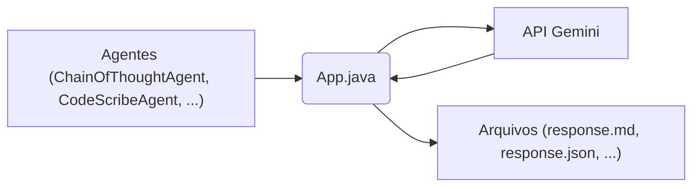

## 1. Estrutura do Projeto 

A estrutura do projeto é organizada de forma lógica e modular, facilitando a compreensão e a extensibilidade.

```
[DIR] ai-agents
  .git
  .gitattributes
  .gitignore
  [DIR] .vscode
    settings.json
  api_key.txt
  bin
  [DIR] lib
    json-20250107.jar
  LICENSE
  README.md
  [DIR] src
    App.java
    ChainOfThoughtAgent.java
    CodeReviewAgent.java
    CodeScribeAgent.java
    ContentReviewerAgent.java
    DeepSearchAgent.java
    GrammarReviewerAgent.java
    SimpleAgent.java
    SimpleSearchAgent.java
    StocksLoggerAgent.java
```

*   **`.git`, `.gitattributes`, `.gitignore`:** Arquivos de controle de versão Git, gerenciando o versionamento do código, normalizando quebras de linha e excluindo arquivos sensíveis e compilados do controle de versão, respectivamente.
*   **`.vscode/settings.json`:** Configurações específicas do VS Code para o projeto, definindo diretórios de código fonte e saída, e incluindo bibliotecas JAR.
*   **`api_key.txt`:** Armazena a chave da API para autenticação com a API Gemini.  Este arquivo é explicitamente ignorado pelo Git para evitar o versionamento de informações sensíveis.
*   **`bin`:** Diretório para arquivos compilados Java.
*   **`lib/json-20250107.jar`:** Biblioteca JSON utilizada para manipulação de dados JSON.
*   **`LICENSE`:** Define a licença MIT para o projeto, permitindo uso, modificação e distribuição livremente, desde que o aviso de copyright seja mantido.
*   **`README.md`:** Documentação do projeto, descrevendo seu propósito, escopo e instruções básicas.
*   **`src`:** Diretório contendo o código fonte Java dos agentes de IA.

## 2. Componentes Principais

### 2.1. `App.java`

Este arquivo contém a classe principal da aplicação e as funções responsáveis pela interação direta com a API Gemini da Google.

*   **`getApiKey()`:** Recupera a chave da API do arquivo `api_key.txt`, solicitando ao usuário caso não exista.
*   **`getGeminiCompletion()`:** Envia um prompt para a API Gemini e retorna a resposta. Salva a requisição e a resposta em arquivos JSON para fins de depuração.
*   **`getGeminiSearchResults()`:** Envia um prompt para a API Gemini com a funcionalidade de busca ativada e retorna a resposta formatada. Salva a resposta em um arquivo JSON.

### 2.2. Agentes de IA (`src/*.java`)

O diretório `src` contém as classes que implementam os diferentes agentes de IA. Cada agente utiliza a classe `App` para interagir com a API Gemini e realizar tarefas específicas.

*   **`ChainOfThoughtAgent.java`:** Utiliza a API Gemini para gerar uma resposta detalhada com raciocínio passo a passo, e então resume essa resposta.
*   **`CodeReviewAgent.java`:** Gera um relatório de melhorias técnicas no projeto, após analisar todos os arquivos.
*   **`CodeScribeAgent.java`:** Gera um relatório técnico detalhado de um projeto, analisando a estrutura de diretórios e o conteúdo dos arquivos.
*   **`ContentReviewerAgent.java`:** Gera um relatório com uma tabela de apontamentos de ajustes semânticos, após analisar todos os arquivos.
*   **`DeepSearchAgent.java`:** Realiza uma pesquisa aprofundada usando a API Gemini, gerando múltiplos prompts e consolidando as respostas.
*   **`GrammarReviewerAgent.java`:** Gera um relatório com uma tabela de apontamentos de ajustes de sintaxe no idioma nativo, após analisar todos os arquivos.
*   **`SimpleAgent.java`:** Envia um prompt pré-definido para a API Gemini e salva a resposta.
*   **`SimpleSearchAgent.java`:** Utiliza a funcionalidade de busca da API Gemini para responder a uma pergunta e salva a resposta formatada.
*   **`StocksLoggerAgent.java`:** Coleta periodicamente os preços de ações da API Gemini e armazena os dados em um arquivo JSON.

## 3. Arquitetura Geral

A arquitetura do projeto é relativamente simples, consistindo em uma classe principal (`App.java`) que interage diretamente com a API Gemini e um conjunto de agentes que utilizam essa classe para realizar tarefas específicas.

